# GameZone — React

Tienda de videojuegos online desarrollada con React y Vite, como migración y mejora del proyecto anterior construido en HTML/CSS/JS. Permite explorar un catálogo de juegos cargado dinámicamente, filtrarlos, buscarlos, descubrir más títulos desde una API externa y agregarlos a un carrito de compras interactivo que se conserva al recargar la página. Incluye un formulario de contacto con validación y un modo administrador (simulado) para agregar y eliminar juegos del catálogo.

---

## Demo

[Ver proyecto en GitHub Pages](https://m-vargas-h.github.io/GameZone-React/)

---

## Tecnologías utilizadas

- **React 19** — librería principal para construcción de la UI
- **Vite** — entorno de desarrollo y bundler
- **Bootstrap 5** — estilos y componentes de interfaz
- **React Router DOM** — navegación entre páginas (Inicio, Catálogo, Carrito, Contacto y Admin)
- **JavaScript ES6+** — lógica de componentes y estado
- **API GameBrain** — juegos adicionales en la sección "Descubre más juegos"
- **gh-pages** — publicación en GitHub Pages

---

## Instalación local

```bash
git clone https://github.com/m-vargas-h/GameZone-React
cd GameZone-React
npm install
npm run dev
```

Abre [http://localhost:5173/GameZone-React/](http://localhost:5173/GameZone-React/) en el navegador.

### Configuración de la API (GameBrain)

La sección "Descubre más juegos" consume la API de [GameBrain](https://gamebrain.co). La clave no se sube al repositorio.
La Key correspondiente estara disponible en la entrega a traves de AVA para poder correr las pruebas en local de ser necesario

Sin clave, la sección muestra un mensaje de error con el botón "Reintentar" y el resto del sitio funciona con normalidad.

---

## Uso

### Páginas

| Ruta | Contenido |
|---|---|
| `/` | Inicio: carrusel, productos destacados, botón "Ver catálogo completo" y "Descubre más juegos" (API) |
| `/catalogo` | Búsqueda y catálogo completo con filtros por plataforma y género |
| `/carrito` | Detalle completo del carrito |
| `/contacto` | Formulario de contacto con validación |
| `/admin` | Login simulado y gestión del catálogo (agregar juegos) |

### Acciones

| Acción | Cómo hacerlo |
|---|---|
| Ver el catálogo completo | Botón "Ver catálogo completo" del inicio o enlace "Catálogo" del navbar |
| Filtrar | Botones de plataforma y género en `/catalogo` (se combinan) |
| Buscar | Escribe en "Buscar juego" y presiona Enter o el botón Buscar |
| Agregar al carrito | Botón "+ Carrito" en cada card; el botón muestra la cantidad (`✓ En el carrito (2)`) |
| Ver y editar el carrito | Botón "Carrito" del navbar (panel lateral) o "Ver carrito" para la página `/carrito` |
| Vaciar el carrito | Botón "Vaciar carrito" en el panel lateral o en la página `/carrito` |
| Contacto | Enlace "Contacto" del navbar; el formulario valida cada campo antes de enviar |
| Administrar el catálogo | Enlace "Admin" del navbar, con las credenciales de prueba (ver más abajo) |

### Credenciales de prueba (administrador)

Las credenciales se leen desde variables de entorno (`VITE_ADMIN_USER` y `VITE_ADMIN_PASS`). Los valores de demostración vienen en `.env.example`:

| Usuario | Clave |
|---|---|
| `admin` | `gamezone123` |

> El inicio de sesión es **simulado**: aunque las credenciales están en el `.env`, Vite las incluye en el build del frontend, por lo que no ofrece seguridad real. Su objetivo es mostrar renderizado condicional según el estado de sesión.

### Cómo comprobar la persistencia del carrito

1. Agrega uno o más juegos al carrito.
2. Recarga la página (F5) o cierra y vuelve a abrir la pestaña.
3. El carrito conserva los juegos y cantidades, y el badge del navbar mantiene el total.
4. Para verificarlo en el navegador: DevTools → Application → Local Storage → clave `gamezone-carrito`.
5. Al usar "Vaciar carrito", la clave queda con una lista vacía (`[]`).

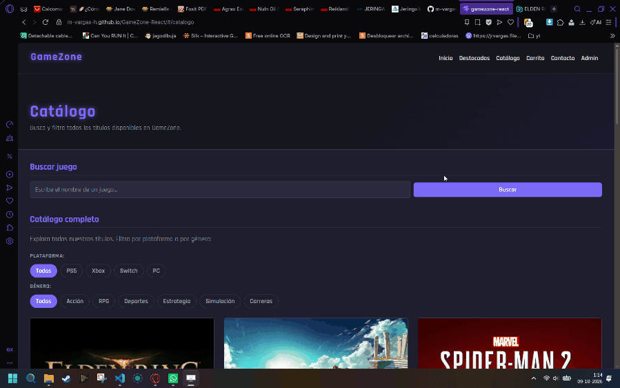

---

## Estructura del proyecto

```
├── public
│   ├── data
│   │   └── productos.json              -> Catálogo de los 15 juegos, cargado con fetch
│   ├── evidencias                      -> Evidencias para README
│   ├── img                             -> Imágenes de portadas y banners
│   ├── favicon.svg
│   └── icons.svg
├── src
│   ├── assets
│   │   ├── hero.png
│   │   └── vite.svg
│   ├── components
│   │   ├── AdminJuegos.jsx             -> Formulario con validación para agregar juegos al catálogo
│   │   ├── Carousel.jsx                -> Carrusel de banners con Bootstrap
│   │   ├── CarritoPanel.jsx            -> Panel lateral del carrito
│   │   ├── DescubreJuegos.jsx          -> Sección "Descubre más juegos" con datos de la API GameBrain
│   │   ├── EstadoCarga.jsx             -> Spinner y alerta de error con reintento del catálogo
│   │   ├── FeaturedProducts.jsx        -> Sección de productos destacados (destacado: true)
│   │   ├── Footer.jsx                  -> Pie de página con datos de contacto
│   │   ├── Navbar.jsx                  -> Navegación, acceso al carrito con badge de cantidad
│   │   ├── ProductCard.jsx             -> Card reutilizable con botón de carrito condicional y botón eliminar (admin)
│   │   ├── ProductList.jsx             -> Catálogo completo con filtros por plataforma y género
│   │   ├── SearchBar.jsx               -> Búsqueda por nombre o categoría con renderizado condicional
│   │   └── ShoppingCart.jsx            -> Contenido del carrito (ítems, cantidades, total y vaciar)
│   ├── hooks
│   │   ├── useAdmin.js                 -> Custom Hook: sesión de administrador simulada (sessionStorage)
│   │   ├── useCarrito.js               -> Custom Hook: estado del carrito y persistencia en localStorage
│   │   ├── useJuegosExternos.js        -> Custom Hook: carga de juegos desde la API GameBrain
│   │   └── useProductos.js             -> Custom Hook: carga del catálogo, agregar y eliminar juegos
│   ├── pages
│   │   ├── Admin.jsx                   -> Página /admin: login simulado y gestión del catálogo
│   │   ├── CarritoPagina.jsx           -> Página /carrito con el detalle completo
│   │   ├── Catalogo.jsx                -> Página /catalogo: búsqueda y catálogo completo con filtros
│   │   └── Contacto.jsx                -> Página de contacto con validación de formulario
│   ├── utils
│   │   └── formato.js                  -> Formateo de precios
│   ├── App.jsx                         -> Componente raíz: conecta los hooks, define las rutas y monta el panel del carrito
│   ├── main.jsx                        -> Punto de entrada, configuración de Bootstrap y Router
│   └── styles.css                      -> Estilos personalizados con variables CSS
├── .env.example                        -> Plantilla de variables de entorno (clave de la API)
├── .gitattributes
├── .gitignore
├── README.md
├── eslint.config.js
├── index.html
├── package-lock.json
├── package.json
└── vite.config.js
```

---

## Funcionalidades implementadas

### 1. Inicio y productos destacados

La página principal muestra el carrusel y los 5 juegos marcados como `destacado: true` en el catálogo, con un botón **Ver catálogo completo** que lleva a `/catalogo`. Debajo se ubica la sección "Descubre más juegos", alimentada por la API externa.

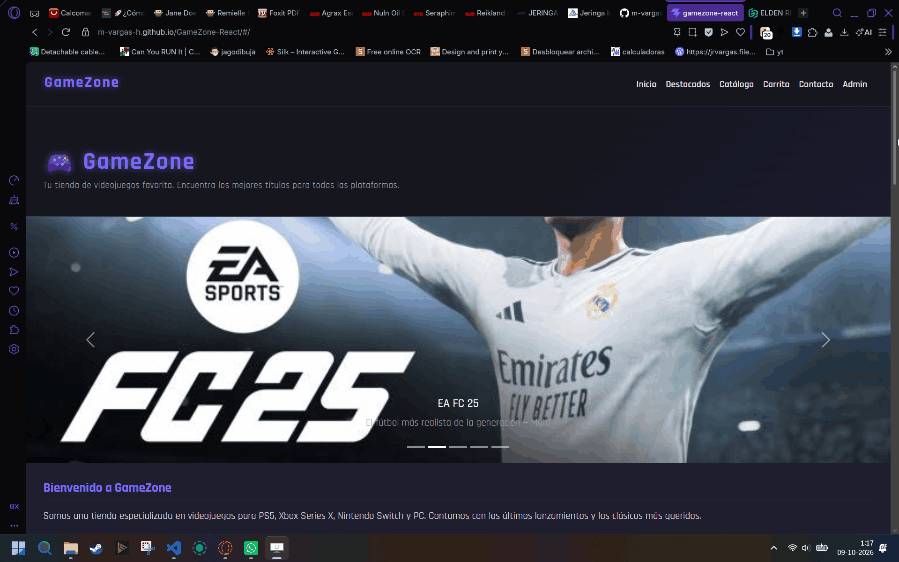

---

### 2. Catálogo completo, filtros y búsqueda

La página `/catalogo` lista los 15 juegos cargados dinámicamente con `fetch` dentro de un `useEffect` en el custom Hook `useProductos`, desde `public/data/productos.json`, y renderizados con `.map()`. Cada card muestra nombre, descripción, imagen, precio normal tachado y precio oferta destacado. El componente `ProductCard` se reutiliza en destacados, catálogo y resultados de búsqueda.


**Filtros.** El catálogo se filtra en tiempo real por plataforma y género (combinables) usando `useState`. Los botones pill muestran el filtro activo con la clase `active`. Si ningún juego coincide, se muestra un mensaje informativo (renderizado condicional).


**Búsqueda.** Busca por nombre o categoría sobre el catálogo cargado. Muestra resultados dinámicamente y mensajes de estado cuando no hay coincidencias o el campo está vacío.


---

### 3. Descubre más juegos (API externa)

La sección consume la API de GameBrain mediante el custom Hook `useJuegosExternos`: `fetch` dentro de un `useEffect`, con `AbortController`, estados de carga y error, y botón **Reintentar**. Como los campos de la API pueden variar, el hook los normaliza (nombre, imagen, género, plataforma, rating y enlace) antes de entregarlos al componente `DescubreJuegos`, que renderiza una card por juego. La clave de la API se lee desde `import.meta.env.VITE_GAMEBRAIN_KEY` (ver [Configuración de la API](#configuración-de-la-api-gamebrain)).

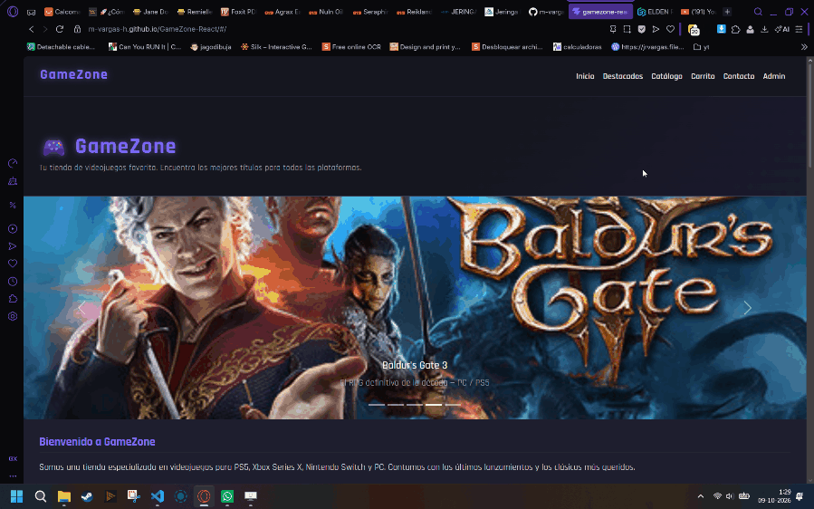

---

### 4. Carrito de compras

El carrito se abre como un **panel lateral** desde el botón "Carrito" del navbar, disponible en todas las páginas. Permite modificar la cantidad con `+` y `−`, eliminar ítems, **vaciar el carrito completo** y ver el total, calculado con `.reduce()` sobre el precio oferta por cantidad. El navbar muestra un badge con el total de unidades.

Desde el panel, el botón **Ver carrito** lleva a la página `/carrito`, con el mismo contenido en formato de página completa (incluido el botón "Vaciar carrito").

El estado y las operaciones del carrito (`agregarAlCarrito`, `modificarCantidad`, `eliminarDelCarrito`, `vaciarCarrito`) viven en el custom Hook `useCarrito`, que además guarda el contenido en `localStorage` con un `useEffect`, por lo que el carrito se conserva al recargar la página.


---

### 5. Formulario de contacto

Página independiente accesible desde el navbar (`/contacto`). El formulario usa `<form>` con `onSubmit`, por lo que también se envía con la tecla Enter. Valida nombre, correo, motivo y mensaje antes de enviar, muestra errores inline por campo y un mensaje de confirmación tras el envío exitoso. Los campos se limpian automáticamente.


---

### 6. Administración del catálogo (agregar y eliminar juegos)

La página `/admin` muestra un **inicio de sesión simulado** (hook `useAdmin`, sesión en `sessionStorage`, válida mientras dure la pestaña). Según el estado de sesión se renderiza de forma condicional:

- **Sin sesión:** solo el formulario de login, con mensajes de error si los campos están vacíos o las credenciales son incorrectas. En el catálogo no aparece ningún botón de eliminar.
- **Con sesión:** el formulario `AdminJuegos` para **agregar** un juego (nombre, precio, género, plataforma, imagen opcional y descripción, todo con validación), un botón para cerrar sesión, y el botón **Eliminar juego** en cada card del catálogo.

Las operaciones modifican el estado `productos` del hook `useProductos` (`agregarProducto` y `eliminarProducto`), que se pasa por props hasta los componentes. Al eliminar un juego que estaba en el carrito, también se quita del carrito. Los cambios del catálogo viven en el estado de React, por lo que se reinician al recargar la página.

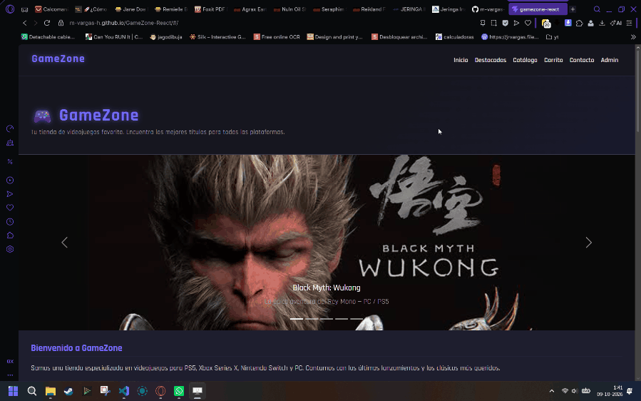
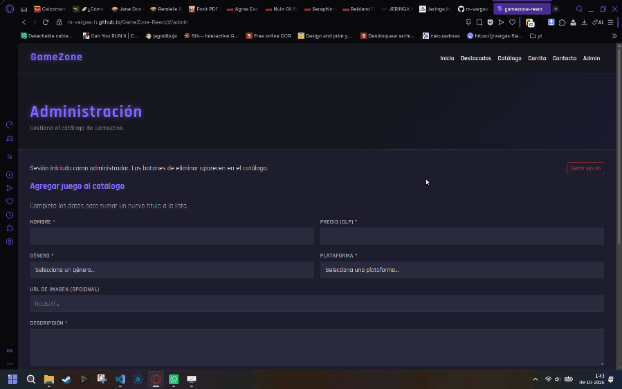
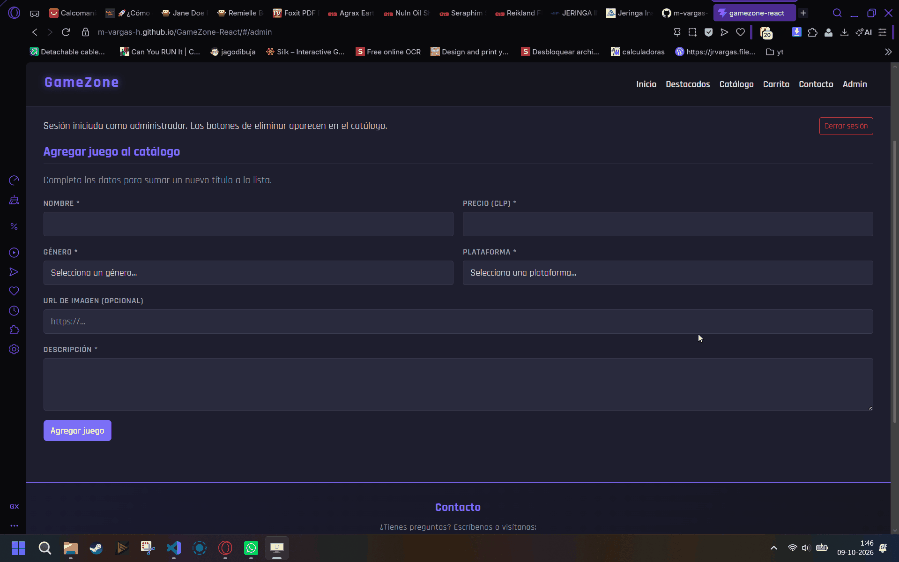

---

### 7. Hooks y renderizado condicional

**Datos dinámicos con `useState` y `useEffect`.** El hook `useProductos` mantiene los estados `productos`, `cargando` y `error`. Un `useEffect` carga el catálogo con `fetch` al montar la aplicación y en cada reintento, con `AbortController` para limpiar la petición.


**Renderizado condicional.**

- Spinner "Cargando catálogo..." mientras se obtienen los datos, y alerta con botón **Reintentar** si la carga falla (componente `EstadoCarga`).
- Estados equivalentes (carga, error con reintento, sin resultados) en "Descubre más juegos".
- Botón de cada card: "+ Carrito" cambia a "✓ En el carrito (n)" con la cantidad actual si el juego ya fue agregado.
- Mensaje "Tu carrito está vacío"; el botón **Ver carrito** y el botón **Vaciar carrito** aparecen solo cuando hay productos.
- Formulario de login o gestión del catálogo según la sesión de administrador, y botón "Eliminar juego" visible solo con sesión iniciada.


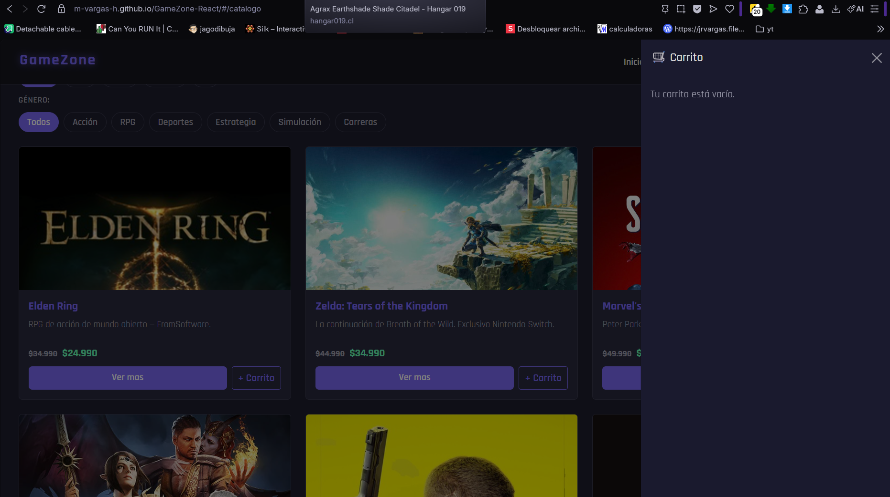
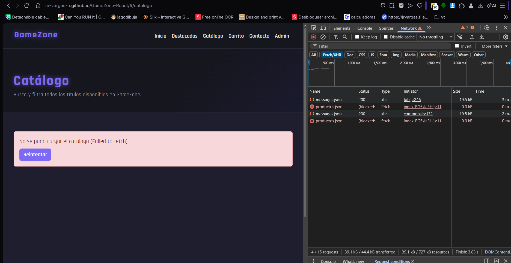

| Hook | Uso |
|---|---|
| `useState` | Catálogo, estados de carga y error, carrito, sesión admin, filtros, búsqueda y campos de los formularios |
| `useEffect` | Carga del catálogo y de la API con `fetch`, persistencia del carrito en `localStorage`, control del carrusel |
| `useProductos` (custom) | Encapsula la carga del catálogo (carga, error, reintento) y las operaciones de agregar y eliminar juegos |
| `useJuegosExternos` (custom) | Encapsula la carga de juegos desde la API GameBrain, con normalización de datos y reintento |
| `useCarrito` (custom) | Encapsula el estado del carrito, sus operaciones (incluido vaciar) y su persistencia |
| `useAdmin` (custom) | Encapsula la sesión de administrador simulada |

---

## Componentes y reutilización

| Componente | Descripción |
|---|---|
| `App` | Conecta los custom Hooks, define las rutas y monta el panel del carrito |
| `ProductCard` | Card de producto reutilizada en destacados, catálogo y búsqueda; su botón cambia según el carrito y muestra "Eliminar juego" solo si recibe la función (sesión admin) |
| `ProductList` | Catálogo con filtros internos via `useState` |
| `FeaturedProducts` | Filtra productos con `destacado: true` |
| `SearchBar` | Búsqueda con estado propio y resultados condicionales |
| `EstadoCarga` | Spinner y alerta de error con reintento, reutilizado en Inicio y Catálogo |
| `DescubreJuegos` | Sección con juegos de la API externa y sus estados de carga y error |
| `ShoppingCart` | Contenido del carrito, reutilizado en el panel lateral y en la página `/carrito` |
| `CarritoPanel` | Panel lateral (Offcanvas) con el carrito y acceso a la página `/carrito` |
| `AdminJuegos` | Formulario controlado con validación para agregar juegos |
| `Navbar` | Navegación y botón del carrito con badge de cantidad |

Páginas: `Catalogo`, `CarritoPagina`, `Contacto` y `Admin`.

---

## Compatibilidad y diseño responsivo

El sitio usa el sistema de grid de Bootstrap (`col-12 col-md-6 col-lg-4`), un navbar colapsable y Flexbox en el CSS personalizado. Se probó en:

| Entorno | Resultado |
|---|---|
| Escritorio (Opera) | Correcto |
| Escritorio (Brave) | Correcto |
| Tablet (vista responsiva) | Correcto |
| Móvil (vista responsiva) | Correcto |

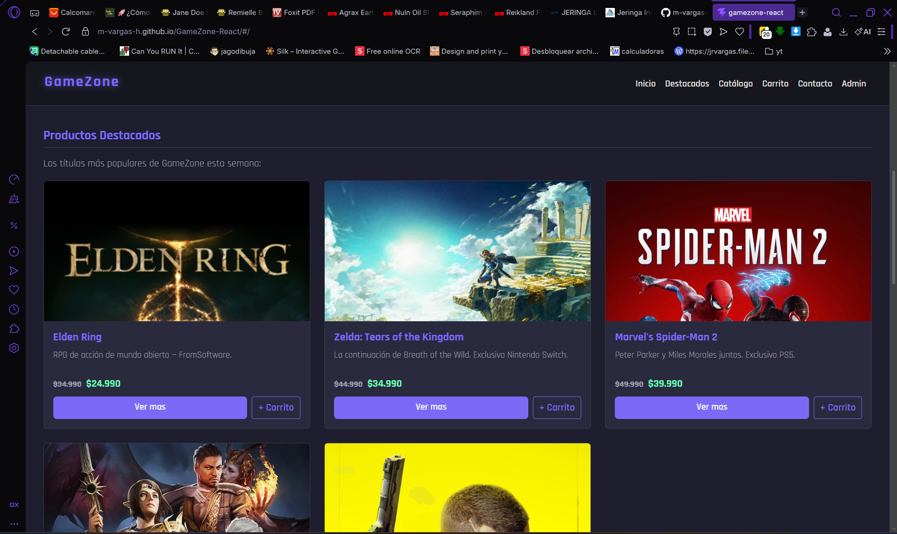
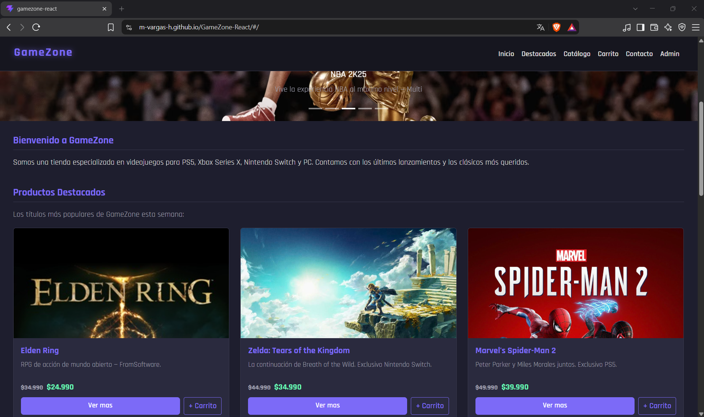
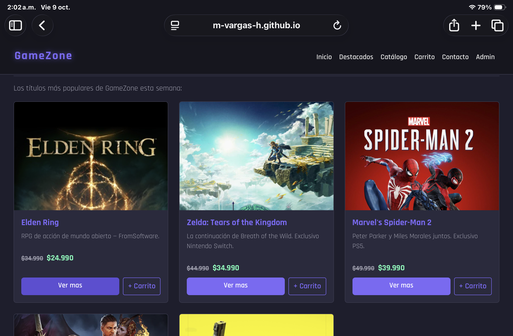
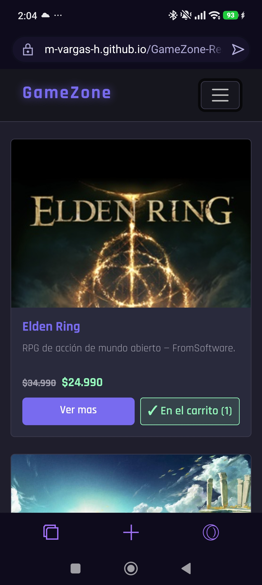

---

## Publicación en GitHub Pages

```bash
npm run deploy
```

Esto genera el build en `/dist` y lo publica automáticamente en la rama `gh-pages`. La configuración para React incluye `base: '/GameZone-React/'` en `vite.config.js` y `HashRouter`, para que las rutas funcionen al recargar en GitHub Pages. El build lee la clave de la API desde el `.env` local.

---

## Decisiones de diseño

### Lógica separada en custom Hooks

La lógica de estado se separó de los componentes en cuatro hooks (`useProductos`, `useJuegosExternos`, `useCarrito`, `useAdmin`). `App` solo conecta los de catálogo, carrito y sesión, y coordina las operaciones que cruzan dominios (por ejemplo, eliminar un juego también lo quita del carrito). `DescubreJuegos` usa su propio hook, por lo que la API solo se consulta al visitar el inicio.

### Catálogo en página aparte

El inicio muestra solo los 5 destacados y un acceso al catálogo completo (`/catalogo`), que concentra búsqueda y filtros. Así la portada es más liviana y cada página tiene una responsabilidad clara.

### Rutas de imágenes independientes del despliegue

Las imágenes se referencian de forma relativa (`img/...`) en los datos y el carrusel, y se resuelven con `import.meta.env.BASE_URL` al renderizar. Así, un cambio en la ruta de despliegue solo requiere modificar `base` en `vite.config.js`. Los juegos agregados desde el formulario admin pueden usar una URL completa (`http...`), que se usa tal cual.

### Clave de la API fuera del repositorio

La clave de GameBrain se guarda en un `.env` (ignorado por Git) y se expone solo mediante `import.meta.env`. El repositorio incluye `.env.example` como plantilla. Al ser un sitio estático, la clave queda incluida en el build publicado, por lo que se usa una clave dedicada a este proyecto.

### Login simulado y catálogo en memoria

Al no existir un backend, la sesión de administrador es una simulación: las credenciales se leen desde variables de entorno y se validan en el frontend. Los juegos agregados o eliminados se mantienen solo en el estado de React (se reinician al recargar). Es suficiente para demostrar state, props y renderizado condicional.

---