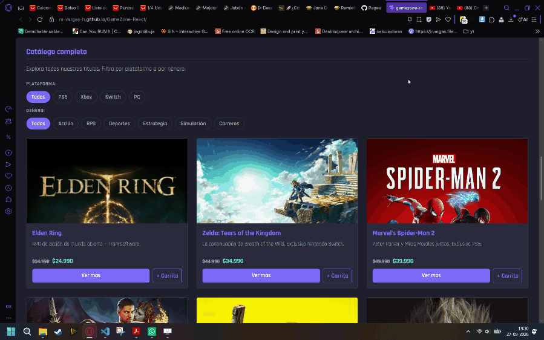
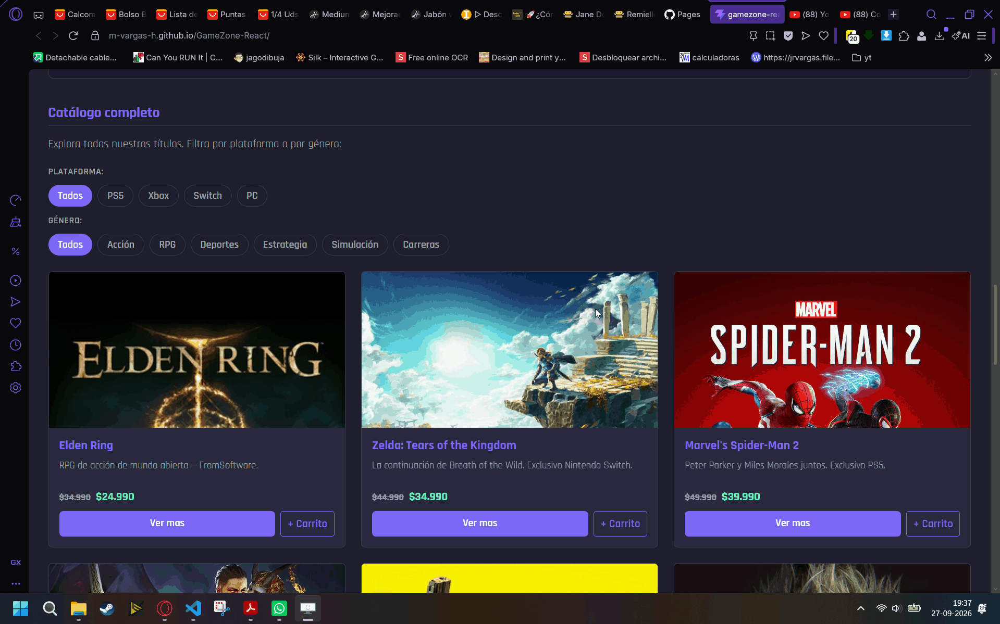
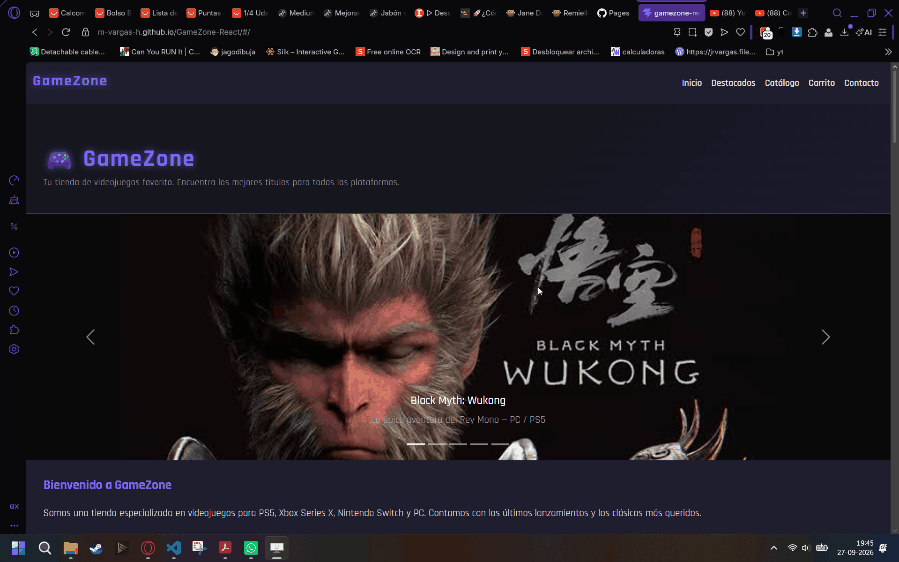
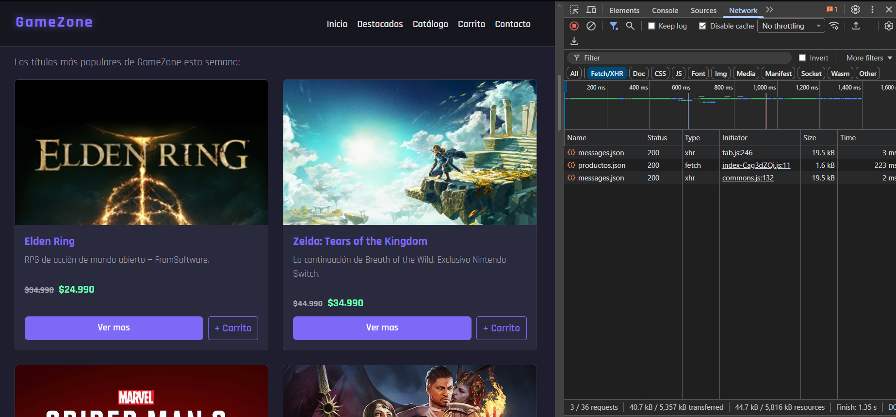
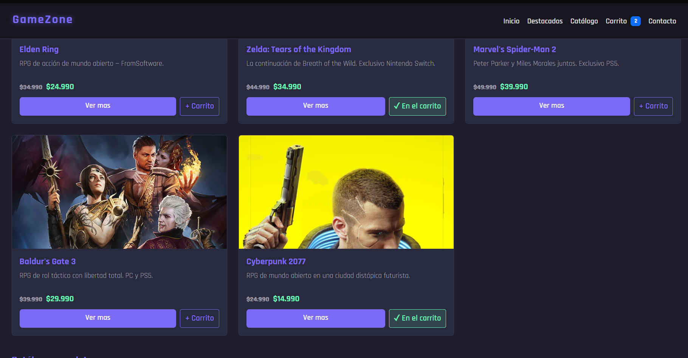

# GameZone — React

Tienda de videojuegos online desarrollada con React y Vite, como migración y mejora del proyecto anterior construido en HTML/CSS/JS. Permite explorar un catálogo de juegos cargado dinámicamente, filtrarlos, buscarlos y agregarlos a un carrito de compras interactivo que se conserva al recargar la página.

---

## Demo

[Ver proyecto en GitHub Pages](https://m-vargas-h.github.io/GameZone-React/)

---

## Tecnologías utilizadas

- **React 19** — librería principal para construcción de la UI
- **Vite** — entorno de desarrollo y bundler
- **Bootstrap 5** — estilos y componentes de interfaz
- **React Router DOM** — navegación entre páginas (Home, Carrito y Contacto)
- **JavaScript ES6+** — lógica de componentes y estado
- **gh-pages** — publicación en GitHub Pages

---

## Estructura del proyecto

```
├── public
│   ├── data
│   │   └── productos.json              -> Catálogo de los 15 juegos, cargado con fetch
│   ├── evidencias                      -> Evidencias para README
│   ├── img                             -> Imágenes de portadas y banners
│   ├── favicon.svg
│   └── icons.svg
├── src
│   ├── assets
│   │   ├── hero.png
│   │   └── vite.svg
│   ├── components
│   │   ├── Carousel.jsx                -> Carrusel de banners con Bootstrap
│   │   ├── CarritoPanel.jsx            -> Panel lateral del carrito
│   │   ├── FeaturedProducts.jsx        -> Sección de productos destacados (destacado: true)
│   │   ├── Footer.jsx                  -> Pie de página con datos de contacto
│   │   ├── Navbar.jsx                  -> Navegación, acceso al carrito con badge de cantidad
│   │   ├── ProductCard.jsx             -> Card reutilizable con botón de carrito condicional
│   │   ├── ProductList.jsx             -> Catálogo completo con filtros por plataforma y género
│   │   ├── SearchBar.jsx               -> Búsqueda por nombre o categoría con renderizado condicional
│   │   └── ShoppingCart.jsx            -> Contenido del carrito (ítems, cantidades y total)
│   ├── hooks
│   │   └── useCarrito.js               -> Custom Hook: estado del carrito y persistencia en localStorage
│   ├── pages
│   │   ├── CarritoPagina.jsx           -> Página /carrito con el detalle completo
│   │   └── Contacto.jsx                -> Página de contacto con validación de formulario
│   ├── utils
│   │   └── formato.js                  -> Formateo de precios
│   ├── App.jsx                         -> Componente raíz: carga del catálogo, rutas y panel del carrito
│   ├── main.jsx                        -> Punto de entrada, configuración de Bootstrap y Router
│   └── styles.css                      -> Estilos personalizados con variables CSS
├── .gitattributes
├── .gitignore
├── README.md
├── eslint.config.js
├── index.html
├── package-lock.json
├── package.json
└── vite.config.js
```

---

## Funcionalidades implementadas

### 1. Catálogo de productos

Listado de 15 juegos cargado dinámicamente con `fetch` dentro de un `useEffect` en `App`, desde `public/data/productos.json`, y renderizado con `.map()`. Cada card muestra nombre, descripción, imagen, precio normal tachado y precio oferta destacado. El componente `ProductCard` se reutiliza en el catálogo, destacados y resultados de búsqueda.



---

### 2. Carrito de compras

El carrito se abre como un **panel lateral** desde el botón "Carrito" del navbar, disponible en todas las páginas. Permite modificar la cantidad con `+` y `−`, eliminar ítems y ver el total, calculado con `.reduce()` sobre el precio oferta por cantidad. El navbar muestra un badge con el total de unidades.

Desde el panel, el botón **Ver carrito** lleva a la página `/carrito`, con el mismo contenido en formato de página completa.

El estado y las operaciones del carrito viven en el custom Hook `useCarrito`, que además guarda el contenido en `localStorage` con un `useEffect`, por lo que el carrito se conserva al recargar la página.


---

### 3. Filtros por plataforma y género

El catálogo se filtra en tiempo real usando `useState`. Los botones pill muestran el filtro activo con la clase `active`. Si ningún juego coincide con el filtro seleccionado, se muestra un mensaje informativo (renderizado condicional).



---

### 4. Búsqueda de juegos

Busca por nombre o categoría sobre el catálogo cargado. Muestra resultados dinámicamente y mensajes de estado cuando no hay coincidencias o el campo está vacío (renderizado condicional con `useState`).


---

### 5. Formulario de contacto

Página independiente accesible desde el navbar (`/contacto`). El formulario usa `<form>` con `onSubmit`, por lo que también se envía con la tecla Enter. Valida nombre, correo, motivo y mensaje antes de enviar, muestra errores inline por campo y un mensaje de confirmación tras el envío exitoso. Los campos se limpian automáticamente.



---

### 6. Hooks y renderizado condicional

**Datos dinámicos con `useState` y `useEffect`.** `App` mantiene los estados `productos`, `cargando` y `error`. Un `useEffect` carga el catálogo con `fetch` al montar la aplicación y en cada reintento, con `AbortController` para limpiar la petición.



**Renderizado condicional.**

- Spinner "Cargando catálogo..." mientras se obtienen los datos.
- Alerta con botón **Reintentar** si la carga falla.
- Botón de cada card: "+ Carrito" cambia a "✓ En el carrito" si el juego ya fue agregado.
- Mensaje "Tu carrito está vacío" y botón **Ver carrito** visible solo cuando hay productos.



| Hook | Uso |
|---|---|
| `useState` | Catálogo, estados de carga y error, carrito, filtros, búsqueda y campos del formulario |
| `useEffect` | Carga del catálogo con `fetch`, persistencia del carrito en `localStorage`, control del carrusel |
| `useCarrito` (custom) | Encapsula el estado del carrito, sus operaciones y su persistencia |

---

## Componentes y reutilización

| Componente | Descripción |
|---|---|
| `App` | Carga el catálogo (`useEffect` + `fetch`), define las rutas y monta el panel del carrito |
| `ProductCard` | Card de producto reutilizada en catálogo, destacados y búsqueda; su botón cambia según el carrito |
| `ProductList` | Catálogo con filtros internos via `useState` |
| `FeaturedProducts` | Filtra productos con `destacado: true` |
| `SearchBar` | Búsqueda con estado propio y resultados condicionales |
| `ShoppingCart` | Contenido del carrito, reutilizado en el panel lateral y en la página `/carrito` |
| `CarritoPanel` | Panel lateral (Offcanvas) con el carrito y acceso a la página `/carrito` |
| `Navbar` | Navegación y botón del carrito con badge de cantidad |

---

## Instalación local

```bash
git clone https://github.com/m-vargas-h/GameZone-React
cd GameZone-React
npm install
npm run dev
```

Abre [http://localhost:5173/GameZone-React/](http://localhost:5173/GameZone-React/) en el navegador.

---

## Publicación en GitHub Pages

```bash
npm run deploy
```

Esto genera el build en `/dist` y lo publica automáticamente en la rama `gh-pages`. La configuración para React incluye `base: '/GameZone-React/'` en `vite.config.js` y `HashRouter`, para que las rutas funcionen al recargar en GitHub Pages.

---

## Decisiones de diseño

### Rutas de imágenes independientes del despliegue

Las imágenes se referencian de forma relativa (`img/...`) en los datos y el carrusel, y se resuelven con `import.meta.env.BASE_URL` al renderizar. Así, un cambio en la ruta de despliegue solo requiere modificar `base` en `vite.config.js`.

### API externa GameBrain

La versión anterior del proyecto integraba la API externa **GameBrain** para cargar juegos en tiempo real. En esta migración se excluyó por la inestabilidad que presentaba en producción. La carga del catálogo ya sigue el patrón `useEffect` + estados de carga, error y reintento, por lo que incorporar una API externa es el siguiente paso previsto para la entrega final.

---

## Próximos pasos

- Integrar una API externa para ampliar el catálogo, aprovechando la estructura de carga, error y reintento existente.