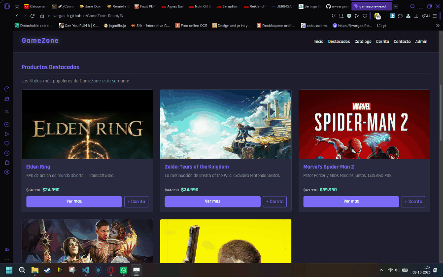

# GameZone — React

Tienda de videojuegos online desarrollada con React y Vite, como migración y mejora del proyecto anterior construido en HTML/CSS/JS. Permite explorar un catálogo de juegos, filtrarlos, buscarlos y agregarlos a un carrito de compras interactivo.

---

## Demo

[Ver proyecto en GitHub Pages](https://m-vargas-h.github.io/GameZone-React/)

---

## Tecnologías utilizadas

- **React 18** — librería principal para construcción de la UI
- **Vite** — entorno de desarrollo y bundler
- **Bootstrap 5** — estilos y componentes de interfaz
- **React Router DOM** — navegación entre páginas (Home y Contacto)
- **JavaScript ES6+** — lógica de componentes y estado

---

## Estructura del proyecto

```
├── public
│   ├── evidencias                  -> Evidencias para README
│   ├── img                         -> Imágenes de portadas y banners
│   ├── favicon.svg
│   └── icons.svg
├── src
│   ├── assets
│   │   ├── hero.png
│   │   └── vite.svg
│   ├── components
│   │   ├── Carousel.jsx            -> Carrusel de banners con Bootstrap
│   │   ├── FeaturedProducts.jsx    -> Sección de productos destacados (destacado: true)
│   │   ├── Footer.jsx              -> Pie de página con datos de contacto
│   │   ├── Navbar.jsx              -> Barra de navegación con enlaces internos y a Contacto
│   │   ├── ProductCard.jsx         -> Card reutilizable para cada juego
│   │   ├── ProductList.jsx         -> Catálogo completo con filtros por plataforma y género
│   │   ├── SearchBar.jsx           -> Búsqueda por nombre o categoría con renderizado condicional
│   │   └── ShoppingCart.jsx        -> Carrito con cantidad, subtotales y total
│   ├── data
│   │   └── productos.json          -> Datos de los 15 juegos del catálogo
│   ├── pages
│   │   └── Contacto.jsx            -> Página de contacto con validación de formulario
│   ├── App.jsx                     -> Componente raíz con estado del carrito y rutas
│   ├── main.jsx                    -> Punto de entrada, configuración de Bootstrap y Router
│   └── styles.css                  -> Estilos personalizados con variables CSS
├── .gitattributes
├── .gitignore
├── README.md
├── eslint.config.js
├── index.html
├── package-lock.json
├── package.json
└── vite.config.js
```

---

## Funcionalidades implementadas

### 1. Catálogo de productos

Listado de 15 juegos renderizado dinámicamente desde `productos.json` usando `.map()`. Cada card muestra nombre, descripción, imagen, precio normal tachado y precio oferta destacado. Componente `ProductCard` reutilizable en el catálogo, destacados y resultados de búsqueda.


---

### 2. Carrito de compras

Permite agregar productos, modificar la cantidad con botones `+` y `−`, y eliminar ítems individualmente. El total se calcula con `.reduce()` sobre el precio oferta por cantidad. El badge del navbar muestra el total de unidades en el carrito.
Ademas, cuando el carrito no tiene productos se muestra el mensaje "Tu carrito está vacío". Al agregar al menos un producto, el mensaje desaparece y se renderiza la lista de ítems con el total.



---

### 3. Filtros por plataforma y género

El catálogo se filtra en tiempo real usando `useState`. Los botones pill muestran el filtro activo con la clase `active`. Si ningún juego coincide con el filtro seleccionado, se muestra un mensaje informativo (renderizado condicional).


---

### 4. Búsqueda de juegos

Busca por nombre o categoría sobre el array de productos local. Muestra resultados dinámicamente y mensajes de estado cuando no hay coincidencias o el campo está vacío (renderizado condicional con `useState`).


---

### 5. Formulario de contacto

Página independiente accesible desde el navbar (`/contacto`). Valida nombre, correo, motivo y mensaje antes de enviar. Muestra errores inline por campo y un mensaje de confirmación tras el envío exitoso. Los campos se limpian automáticamente.


---

## Componentes y reutilización

| Componente | Descripción |
|---|---|
| `ProductCard` | Card de producto reutilizada en catálogo, destacados y búsqueda |
| `ProductList` | Catálogo con filtros internos via `useState` |
| `FeaturedProducts` | Filtra productos con `destacado: true` del JSON |
| `SearchBar` | Búsqueda con estado propio y resultados condicionales |
| `ShoppingCart` | Recibe `carrito`, `eliminarDelCarrito` y `modificarCantidad` como props |
| `App` | Estado global del carrito; pasa funciones como props a los componentes hijos |

---

## Instalación local

```bash
git clone https://github.com/m-vargas-h/GameZone-React
cd GameZone-React
npm install
npm run dev
```

Abre [http://localhost:5173](http://localhost:5173) en el navegador.

---

## Publicación en GitHub Pages

```bash
npm run deploy
```

Esto genera el build en `/dist` y lo publica automáticamente en la rama `gh-pages`.

---

## Decisiones de diseño

### API externa GameBrain

La versión anterior del proyecto integraba la API externa **GameBrain** para cargar juegos en tiempo real en la sección "Descubre más juegos". En esta migración a React se tomó la decisión de excluirla temporalmente por las siguientes razones:

- Su integración en React requiere el hook `useEffect` para manejar efectos secundarios y llamadas asíncronas, por lo que su integración se trabajará en entregas posteriores.
- La API presenta inestabilidad en producción, lo que podría afectar la experiencia en el entorno publicado en GitHub Pages.

---